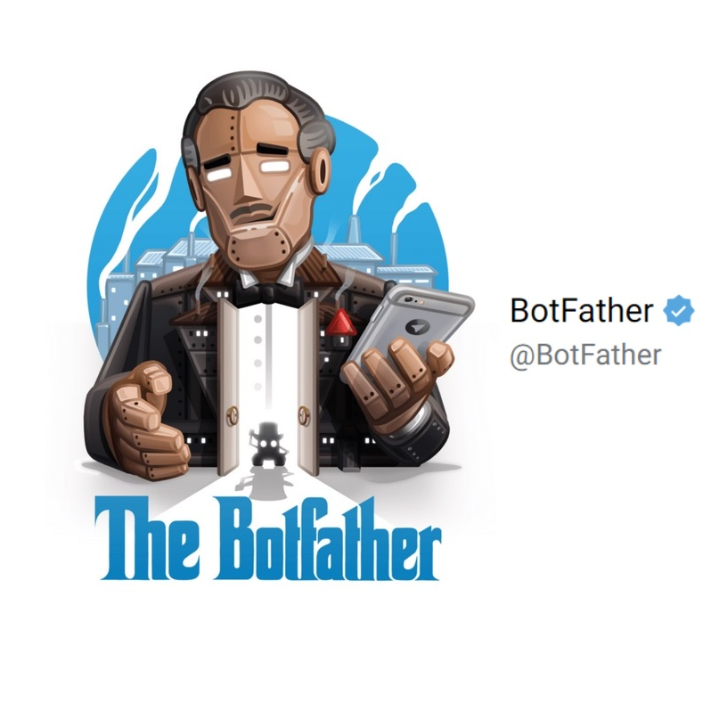

# Création d'un BOT TELEGRAM :

Ce sript fonctionne sous Python 3 ==>

**Le but de ce script est de créer un bot avec trois fonctions principales:**

1.Récupérer l'image du jour du site de la nasa

2. Récupérer une citation chaque jour différente

3. Récupérer le dernier article de presse sur le site Reflet Info

---

Note:

_Bien entendu le bot ne fonctionne dans l'application Telegram, que si le script est en cours d'exécution_

_Un token nécessaire au fonctionnement du bot. Le mien n'est pas fourni dans le script. Si vous souhaitez créer votre propre bot, il vous faudra donc obtenir votre propre token._

_Une fois obtenu il vous suffira de créer un fichier ***"Token.text"*** dans le dossier où s'exécute le script, et y coller votre token à l'intérieur._

### Pour obtenir un token:

1.Ouvrez télégram sur votre os

2. Dans chat recherchez **"Botfather"** certifié : 

3. Ouvrez la conversation entrer la commande /start

4. Puis la commande : /newbot 

5. Vous devez alors choisir un nom d'utilisateur, vous pourrez ainsi retrouver votre bot.

6. Vous n'avez plus qu'a récupérer votre Token et créer le fichier évoqué plus haut.

---

## Liste des commandes à exécuter pour lancer le programme:

_Pré-requis: se placer depuis le terminal dans le dossier où l'on exécute le script:_

Avant toute chose on clone le répository git:

> git clone https://github.com/LGD-P/Telegram_Bot_projet.git

On créer l'environnement virutel:

> python3 -m venv env

Puis on lance l'installation des modules nécessaires au fonctionnement du script:

> pip install -r requirements.txt

Une fois les modules installés on active l'environnement virutel:

> source env/Scripts/Activate

Il n'y a plus qu'à exécuter le script:

> python bot.py

Voilà le script tourne vous pouvez interroger votre bot !
